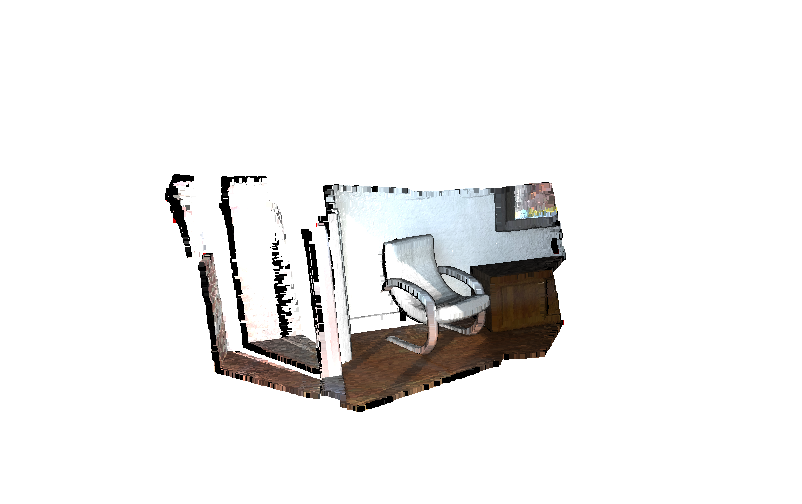
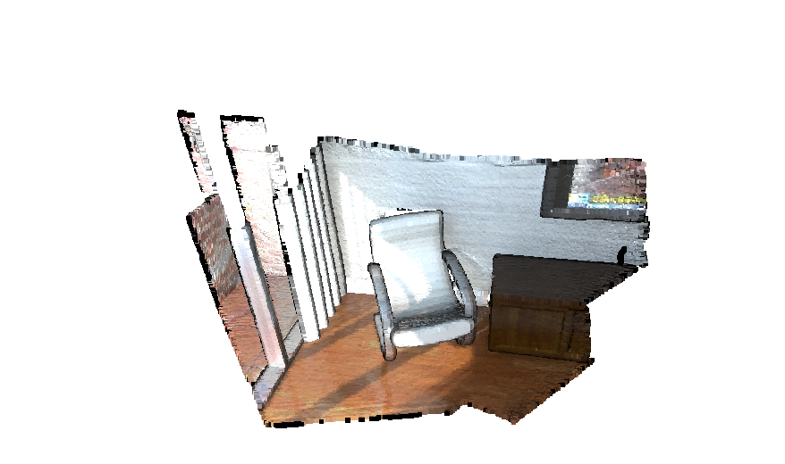

# 3D Point Cloud Segmentation Pipeline




> A production-ready pipeline for segmenting 3D point cloud data using statistical filtering, RANSAC planar detection, and DBSCAN clustering — built with Open3D in Python.

---

## What This Does

Raw 3D scan data is messy. LiDAR captures, photogrammetry outputs, and depth sensor streams all arrive with noise, redundant density, and zero semantic structure. This pipeline solves that in a clean, step-by-step flow:

1. **Load** a PLY point cloud from disk.
2. **Center** the cloud in world space (translate to origin).
3. **Remove noise** with a statistical outlier filter (flags points beyond 10× the neighborhood std deviation).
4. **Downsample** via voxel grid (1 cm voxel size) to normalize point density without losing geometry.
5. **Estimate surface normals** using an adaptive radius derived from the data's own nearest-neighbor distances.
6. **Segment planar surfaces** iteratively with RANSAC (6 passes, each extracting one dominant plane).
7. **Cluster remaining geometry** with DBSCAN to isolate distinct 3D objects from the non-planar residual.
8. **Export** the cleaned, structured point cloud as a `.ply` file.

---

## Pipeline Architecture

```
Raw PLY Input
     │
     ▼
[1] Load + Center              ← o3d.io.read_point_cloud + translate()
     │
     ▼
[2] Statistical Outlier Filter ← nn=16, std_multiplier=10
     │
     ▼
[3] Voxel Downsampling         ← voxel_size=0.01m
     │
     ▼
[4] Normal Estimation          ← radius = mean_nn_dist × 4, max_nn=16
     │
     ▼
[5] Multi-Order RANSAC         ← 6 iterations, dist_threshold=0.02m
     │                            Extracts dominant planes sequentially
     ▼
[6] DBSCAN Clustering          ← eps=0.05, min_points=5
     │                            Clusters non-planar point residuals
     ▼
[7] Export                     ← .ply output
```

---

## Requirements

```bash
pip install open3d numpy matplotlib
```

| Package     | Version   | Role                                   |
|-------------|-----------|----------------------------------------|
| open3d      | ≥ 0.17    | Core geometry ops, I/O, visualization  |
| numpy       | ≥ 1.21    | Numerical array handling               |
| matplotlib  | ≥ 3.5     | Colormap generation for segment labels |

> Python 3.8 or newer is required. Tested on Ubuntu 22.04 and Windows 11.

---

## Installation & Usage

```bash
# 1. Clone the repo
git clone https://github.com/Micahmichael03/3d-pointcloud-segmentation.git
cd 3d-pointcloud-segmentation

# 2. Install dependencies
pip install open3d numpy matplotlib

# 3. Run the pipeline
python 3D_point-cloud_seg.py
```

The script uses Open3D's built-in PLY dataset by default. To use your own data, replace:
```python
DATANAME = o3d.data.PLYPointCloud()
pcd = o3d.io.read_point_cloud(DATANAME.path)
```
with:
```python
pcd = o3d.io.read_point_cloud("path/to/your/file.ply")
```

---

## Key Parameters & What They Control

| Parameter          | Default | Effect                                                              |
|--------------------|---------|---------------------------------------------------------------------|
| `nn`               | 16      | Neighbors used in outlier detection — higher = stricter filtering   |
| `std_multiplier`   | 10      | Outlier threshold multiplier — lower = more aggressive removal      |
| `voxel_size`       | 0.01    | Voxel grid cell size in meters — smaller = denser output            |
| `pt_to_plane_dist` | 0.02    | RANSAC inlier threshold — increase for noisy/coarse scans           |
| `max_plane_idx`    | 6       | Number of planar surfaces to extract iteratively                    |
| `eps`              | 0.05    | DBSCAN neighborhood radius — tune based on object scale             |
| `min_points`       | 5       | Minimum cluster size — increase to filter small noise clusters      |

---

## Output

- **Visualization windows** at each pipeline stage (via Open3D's interactive viewer)
- **`_Point_Cloud.ply`** — the cleaned, downsampled point cloud saved to your project folder
- **Console output** — plane equations from RANSAC and cluster count from DBSCAN

```
Plane equation: 0.01x + -0.00y + 1.00z + 0.49 = 0
pass 1 / 6 done.
...
point cloud has 12 clusters
Successfully exported: _Point_Cloud.ply
```

---

## Author

**Michael Chukwuemeka Micah**
- GitHub: [Micahmichael03](https://github.com/Micahmichael03)
- LinkedIn: [michael-micah003](https://linkedin.com/in/michael-micah003)
- Email: makoflash05@gmail.com