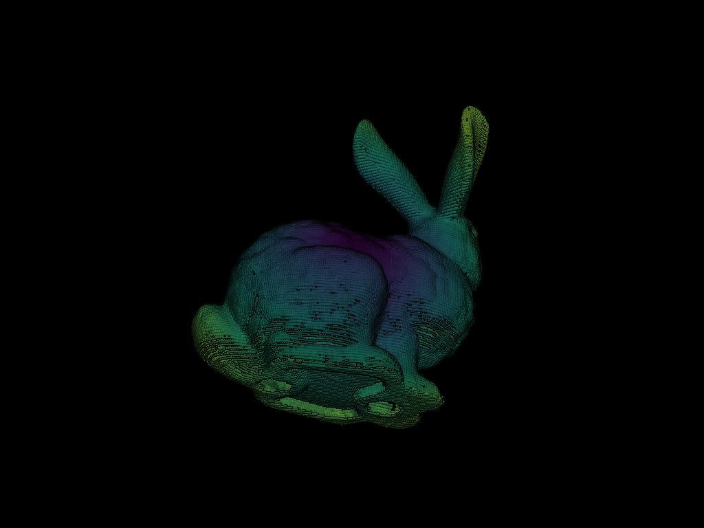

# 3D Point Cloud → Orbital GIF & MP4 Pipeline



[]()
[]()
[]()

> Transform any `.ply` 3D point cloud into a smooth, orbital animation — exported as both a looping GIF and a cinema-quality MP4 — in a single function call.

---

## What This Does

Most 3D visualization tools stop at interactive viewing. This pipeline goes further: it renders your point cloud **off-screen**, programs a cinematic orbital camera path around it, then writes every frame to disk as a production-ready GIF or MP4. The result is a shareable, embeddable animation that communicates 3D geometry to anyone — no 3D viewer required.

**Key capabilities:**
- Load and render `.ply` point cloud files with depth-aware coloring (scalars mapped from each point's distance to the cloud center)
- Apply Eye Dome Lighting (EDL) for enhanced depth perception without a full ray-trace
- Generate smooth 40–100 frame orbital paths with configurable `viewup`, `shift`, and `factor` parameters
- Export to both `.gif` (web-friendly loop) and `.mp4` (24 fps, high-quality video)
- Batch-process entire directories of point clouds via the `cloudgify()` helper function

---

## Pipeline Architecture

```
Input (.ply file)
      │
      ▼
 pv.read()          ← Loads point cloud into a PyVista PolyData object
      │
      ▼
 Scalar computation  ← np.linalg.norm(points - center) per point → depth colormap
      │
      ▼
 pv.Plotter()        ← Off-screen renderer (no GUI window, headless-friendly)
  + add_mesh()       ← Style: points/points_gaussian, EDL, black bg
      │
      ▼
 generate_orbital_path()  ← n_points frames, shift=cloud.length, factor controls orbit radius
      │
      ├──▶ open_gif()  → orbit_on_path() → write_frames=True → .gif
      │
      └──▶ open_movie() → orbit_on_path() → write_frames=True → .mp4
```

---

## Requirements

### Python
Python 3.9 or higher is recommended.

### Dependencies

```bash
pip install pyvista numpy
```

> **Note:** For MP4 export, `ffmpeg` must be installed and accessible on your system PATH.
> - macOS: `brew install ffmpeg`
> - Ubuntu/Debian: `sudo apt install ffmpeg`
> - Windows: Download from https://ffmpeg.org and add to PATH.

PyVista handles VTK internally — no separate VTK install needed.

---

## Installation

```bash
git clone https://github.com/Micahmichael03/3d-point-cloud-to-video.git
cd 3d-point-cloud-to-video
pip install -r requirements.txt
```

**requirements.txt**
```
pyvista>=0.43.0
numpy>=1.24.0
```

---

## Usage

### Single file — quick start

```python
import numpy as np
import pyvista as pv

cloud = pv.read("your_scan.ply")
scalars = np.linalg.norm(cloud.points - cloud.center, axis=1)

pl = pv.Plotter(off_screen=True)
pl.add_mesh(cloud, style='points', render_points_as_spheres=True,
            scalars=scalars, point_size=5.0, show_scalar_bar=False)
pl.background_color = 'k'
pl.enable_eye_dome_lighting()
pl.show(auto_close=False)

viewup = [0, 0, 1]
path = pl.generate_orbital_path(n_points=40, shift=cloud.length, viewup=viewup, factor=3.0)

pl.open_gif("output.gif")
pl.orbit_on_path(path, write_frames=True, viewup=viewup)
pl.close()
```

### Batch processing with `cloudgify()`

```python
dataset_paths = [
    "scans/bunny.ply",
    "scans/dragon.ply",
    "scans/armadillo.ply",
]

for path in dataset_paths:
    cloudgify(path)
# Outputs: bunny.gif, bunny.mp4, dragon.gif, dragon.mp4, etc.
```

`cloudgify()` derives output filenames automatically from the input path — no manual naming required.

---

## Configuration Reference

| Parameter | Location | Default | Effect |
|---|---|---|---|
| `n_points` | `generate_orbital_path` | 40 (GIF), 100 (MP4) | Frame count / smoothness |
| `factor` | `generate_orbital_path` | 3.0 | Orbit radius multiplier |
| `viewup` | multiple | `[0, 0, 1]` | Camera "up" vector |
| `point_size` | `add_mesh` | 5.0 | Visual size of each point |
| `framerate` | `open_movie` | 24 | MP4 playback speed |
| `image_scale` | `pv.Plotter` | 1 | Output resolution multiplier |
| `style` | `add_mesh` | `'points'` / `'points_gaussian'` | Point render style |

> Increase `image_scale` to 2 or 4 for high-resolution exports.

---

## Example Output

The pipeline was tested on the Stanford Bunny (`bun_zipper.ply`).
- **GIF:** 40-frame orbital loop, depth-colored points on black background
- **MP4:** 100-frame, 24 fps orbital video, `points_gaussian` style for a softer look

---

## Project Structure

```
3d-point-cloud-to-video/
├── 3d-to-gif_mp4.py     # Main pipeline script (cells 1–7)
├── requirements.txt
└── README.md
```

---

## Author

**Michael Chukwuemeka Micah**
- GitHub: [Micahmichael03](https://github.com/Micahmichael03)
- LinkedIn: [michael-micah003](https://linkedin.com/in/michael-micah003)
- Email: makoflash05@gmail.com
