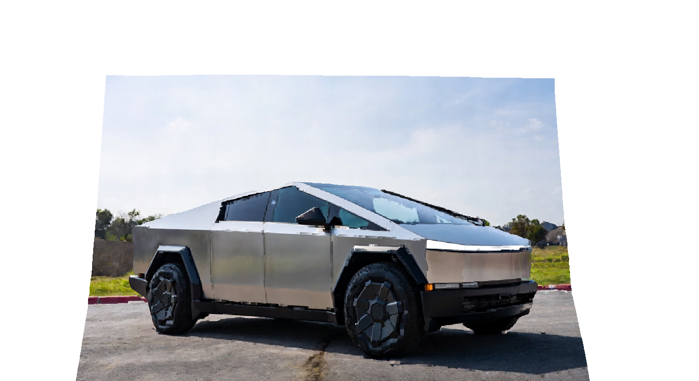

# 🧠 Monocular 3D Point Cloud Generator
### Transform Any Single 2D Image into a Colored 3D Point Cloud using AI Depth Estimation




[](https://www.python.org/)
[](https://pytorch.org/)
[](https://huggingface.co/)
[](http://www.open3d.org/)
[](LICENSE)

---

## 📌 Project Overview

This project implements a **monocular depth estimation pipeline** that converts a single standard 2D photograph into a fully colored, noise-cleaned **3D point cloud** — with zero stereo cameras, LiDAR, or depth sensors required.

At its core, the system leverages **GLPN (Global-Local Path Networks)**, a state-of-the-art transformer-based depth estimation model fine-tuned on the NYU Depth V2 dataset, to infer per-pixel depth from a single RGB image. The predicted depth map and the original color image are then fused into an **RGBD image**, projected into 3D space via pinhole camera geometry, cleaned of statistical outliers, and exported as a standard `.ply` point cloud file.

**Key capabilities:**
- Single image → dense 3D point cloud (no depth camera needed)
- Colored point cloud (each 3D point retains its original RGB value)
- Statistical noise removal for clean, production-quality output
- Export to `.ply` format — compatible with Blender, MeshLab, CloudCompare, and more

---

## 🏗️ Architecture & Pipeline

```
┌─────────────────────────────────────────────────────────────────────┐
│                        INPUT: 2D RGB Image                          │
└───────────────────────────────┬─────────────────────────────────────┘
                                │
                                ▼
┌─────────────────────────────────────────────────────────────────────┐
│  STAGE 1 — Image Preprocessing                                      │
│  • Resize to nearest multiple of 32 (model constraint)              │
│  • Maintain aspect ratio during resize                              │
└───────────────────────────────┬─────────────────────────────────────┘
                                │
                                ▼
┌─────────────────────────────────────────────────────────────────────┐
│  STAGE 2 — AI Depth Estimation (GLPN-NYU)                           │
│  • HuggingFace GLPNImageProcessor tokenizes the image               │
│  • GLPNForDepthEstimation runs inference (no_grad, CPU/GPU)         │
│  • Output: predicted_depth tensor (H × W)                           │
└───────────────────────────────┬─────────────────────────────────────┘
                                │
                                ▼
┌─────────────────────────────────────────────────────────────────────┐
│  STAGE 3 — Post-Processing & Depth Map Extraction                   │
│  • Scale depth values (× 1000 → millimetres)                        │
│  • Crop 16-pixel border padding (artifact removal)                  │
│  • Visualize: Original image | Depth map (plasma colormap)          │
└───────────────────────────────┬─────────────────────────────────────┘
                                │
                                ▼
┌─────────────────────────────────────────────────────────────────────┐
│  STAGE 4 — RGBD Fusion (Open3D)                                     │
│  • Color → uint8 numpy array → Open3D Image                         │
│  • Depth → float32 numpy array (÷1000 → metres) → Open3D Image     │
│  • Fuse into RGBDImage (depth_scale=1.0, depth_trunc=5.0m)          │
└───────────────────────────────┬─────────────────────────────────────┘
                                │
                                ▼
┌─────────────────────────────────────────────────────────────────────┐
│  STAGE 5 — Camera Intrinsics & 3D Projection                        │
│  • Pinhole camera model (f=500px, principal point = image center)   │
│  • Back-project RGBD pixels into 3D XYZ space                       │
│  • Flip transform: correct for inverted Y/Z axes                    │
└───────────────────────────────┬─────────────────────────────────────┘
                                │
                                ▼
┌─────────────────────────────────────────────────────────────────────┐
│  STAGE 6 — Noise Removal                                            │
│  • Statistical outlier removal (nb_neighbors=20, std_ratio=2.0)     │
│  • Eliminates floating artifacts and background noise               │
└───────────────────────────────┬─────────────────────────────────────┘
                                │
                                ▼
┌─────────────────────────────────────────────────────────────────────┐
│  OUTPUT: Colored .PLY 3D Point Cloud                                │
│  Viewable in: Open3D, Blender, MeshLab, CloudCompare               │
└─────────────────────────────────────────────────────────────────────┘
```

---

## ⚙️ Technical Deep-Dive

### Model: GLPN-NYU
[`vinvino02/glpn-nyu`](https://huggingface.co/vinvino02/glpn-nyu) is a **Global-Local Path Network** fine-tuned on the [NYU Depth V2](https://cs.nyu.edu/~silberman/datasets/nyu_depth_v2.html) dataset. It uses a hierarchical Transformer encoder (SegFormer backbone) with a selective feature fusion decoder to produce high-resolution depth maps from monocular RGB input.

### Image Resizing Constraint
GLPN processes images in multiples of 32. The resize logic:
```python
new_height = 480 if image.height > 480 else image.height
new_height -= (new_height % 32)                         # snap to 32
diff = new_width % 32
new_width = new_width - diff if diff < 16 else new_width + 32 - diff
```
This ensures the model receives valid input dimensions while maximizing resolution.

### Depth Scaling
Raw model output is in relative units. Scaling by `× 1000` converts to millimetre-space for depth display. When building the RGBD image, values are divided back by `1000` to work in metres — the standard unit for Open3D's 3D geometry.

### Camera Intrinsics
A simplified pinhole camera is used with:
- **Focal length:** `fx = fy = 500px` (reasonable approximation for standard photography)
- **Principal point:** `(width/2, height/2)` — image center
This model is sufficient for structural reconstruction when true camera parameters are unavailable.

### Outlier Removal
`remove_statistical_outlier(nb_neighbors=20, std_ratio=2.0)` computes the mean distance of each point to its 20 nearest neighbors. Points whose mean distance deviates more than 2 standard deviations from the global mean are discarded — removing noise without over-eroding fine detail.

---

## 🗂️ Project Structure

```
monocular-3d-pointcloud/
│
├── 3d_modes-2d-images.py       # Main pipeline script
├── requirements.txt            # All dependencies
├── README.md                   # This file
└── outputs/
    └── *.ply                   # Generated point cloud files
```

---

## 📦 Requirements & Installation

### Prerequisites
- Python 3.8+
- pip
- (Optional but recommended) CUDA-capable GPU for faster inference

### 1. Clone the Repository
```bash
git clone https://github.com/yourusername/monocular-3d-pointcloud.git
cd monocular-3d-pointcloud
```

### 2. Create a Virtual Environment (Recommended)
```bash
python -m venv venv
source venv/bin/activate        # Linux / macOS
venv\Scripts\activate           # Windows
```

### 3. Install Dependencies
```bash
pip install -r requirements.txt
```

**`requirements.txt`**
```
torch>=2.0.0
torchvision>=0.15.0
transformers>=4.35.0
Pillow>=9.0.0
matplotlib>=3.7.0
numpy>=1.24.0
open3d>=0.18.0
```

> **Note:** For GPU support, install PyTorch with CUDA from [pytorch.org](https://pytorch.org/get-started/locally/).

### 4. Configure Your Input Image
In `3d_modes-2d-images.py`, update line 18 with your image path:
```python
image = Image.open(r"path/to/your/image.jpeg")
```

### 5. Run the Pipeline
```bash
python 3d_modes-2d-images.py
```

---

## 📤 Output

The script produces two outputs:

**1. Side-by-side visualization** (displayed inline via matplotlib):
- Left panel: Original cropped image
- Right panel: Predicted depth map (plasma colormap — warmer = closer)

**2. `Chris_Point_Cloud.ply`** — a colored 3D point cloud saved to the project directory, ready for import into:

| Tool | Import Format |
|---|---|
| Blender | File → Import → Stanford (.ply) |
| MeshLab | File → Import Mesh |
| CloudCompare | File → Open |
| Open3D (Python) | `o3d.io.read_point_cloud("file.ply")` |

---

## 🔧 Configuration & Tuning

| Parameter | Location | Default | Effect |
|---|---|---|---|
| `depth_trunc` | Stage 4 | `5.0` metres | Cut-off for background. Lower = tighter scene |
| `nb_neighbors` | Stage 6 | `20` | Neighbors for outlier check. Higher = stricter |
| `std_ratio` | Stage 6 | `2.0` | Outlier sensitivity. Lower = more aggressive removal |
| `fx, fy` (focal) | Stage 5 | `500.0` | Camera focal length estimate |
| `pad` | Stage 3 | `16` | Border crop to remove model edge artifacts |

---

## 🧪 Model Source & Citation

```bibtex
@inproceedings{kim2022global,
  title={Global-Local Path Networks for Monocular Depth Estimation with Vertical CutDepth},
  author={Kim, Doyeon and Ga, Woonghyun and Ahn, Pyungwhan and Joo, Donggyu and Chun, Sehwan and Kim, Junmo},
  booktitle={arXiv preprint arXiv:2201.07436},
  year={2022}
}
```

Model hosted on HuggingFace: [vinvino02/glpn-nyu](https://huggingface.co/vinvino02/glpn-nyu)

---

## 🚀 Future Improvements

- [ ] CLI argument parsing for input/output paths
- [ ] Batch processing of multiple images
- [ ] Mesh reconstruction (Poisson surface reconstruction via Open3D)
- [ ] Support for alternative depth models (DPT, ZoeDepth, Depth Anything V2)
- [ ] Export to `.pcd`, `.obj`, and `.glb` formats
- [ ] Web UI with Gradio or Streamlit

---

## 📄 License

This project is released under the MIT License. The GLPN model weights are subject to the [HuggingFace model license](https://huggingface.co/vinvino02/glpn-nyu).

---

*Built with 🤗 Transformers · PyTorch · Open3D*