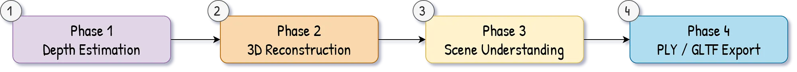

# 🌟 Computer Vision 3D Projects Collection

Welcome to my collection of 3D Computer Vision and Point Cloud processing projects! This repository houses various tools, pipelines, and experiments focused on 3D reconstruction, point cloud segmentation, depth estimation, and 3D visualization.

---

## 🗂️ Projects Overview

### 1. [3D Point Cloud Segmentation and Shape Recognition](3D%20Point%20Cloud%20Segmentation%20and%20Shape%20Recognition%20with%20Python/)
A production-ready pipeline for segmenting 3D point cloud data using statistical filtering, RANSAC planar detection, and DBSCAN clustering — built with Open3D.

 

### 2. [Monocular 3D Point Cloud Generator (2D to 3D)](3d%20models%20from%202d%20images/)
Transform any single 2D image into a colored 3D point cloud using AI Depth Estimation (GLPN-NYU) without requiring stereo cameras or LiDAR.

 

### 3. [3D Point Cloud to Orbital Video (GIF & MP4)](3D-to-Video-auto%20gif%20and%20mp4/)
Transform any `.ply` 3D point cloud into a smooth, orbital animation. This pipeline exports the results as both a looping GIF and a cinema-quality MP4.

### 4. [3D Reconstruction with Depth-Anything-3](3d-reconstruction-depth-anything-main/)
Turn any set of images into 3D point clouds, voxel meshes & Gaussian splats using the Depth-Anything-3 model.

### 5. [Structure from Motion (SfM) Reconstruction](sfm_reconstruction/)
Reconstruct 3D scenes from multiple overlapping 2D images using Structure from Motion (SfM) techniques and camera calibrations.

### 6. [3D City Models from OpenStreetMap](Generate_3d-city-models_from%20_OpenStreetMap(osm)/)
Generate basic 3D city models by extracting structural and geographical data directly from OpenStreetMap (OSM).

### 7. [3D Point Cloud Labelling from 2D Images](3D-Point-cloud-labelling%20from%202D%20images/)
Scripts and tools designed to project 2D image labels and segmentations directly onto 3D point clouds.

---

## ⚙️ Getting Started

Each project folder is self-contained and comes with its own `README.md` file and `requirements.txt`. 

To get started with a specific project:
1. Navigate to the project's directory.
2. Install the specific dependencies (e.g., `pip install -r requirements.txt`).
3. Follow the instructions in the specific folder's `README.md`.

---
*Created and maintained as a comprehensive workspace for 3D Computer Vision workflows.*